# ⚔️ ArmyOptimizer — Manual d’Usuari

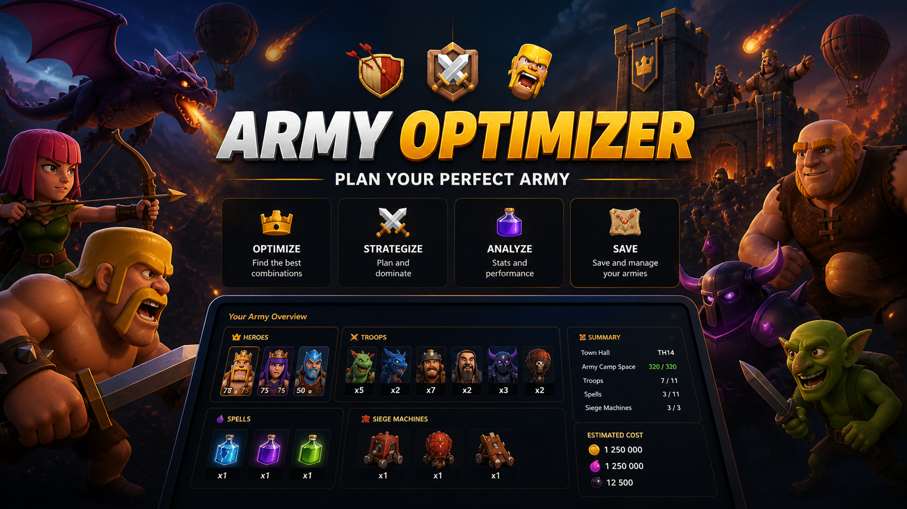

## 📌 Informació

- 👤 Autor: Èric Viñas
- 📅 Data: 04/05/2026
- 🚀 Versió: 1.0

---

# 📘 1. Introducció

## 🎯 Què és ArmyOptimizer

ArmyOptimizer és una aplicació de planificació d’exèrcits pensada per construir, validar i optimitzar una composició completa segons el teu Town Hall, la capacitat disponible i l’objectiu de l’atac.

---

# 🔐 2. Registre i Login

## 📝 Crear compte

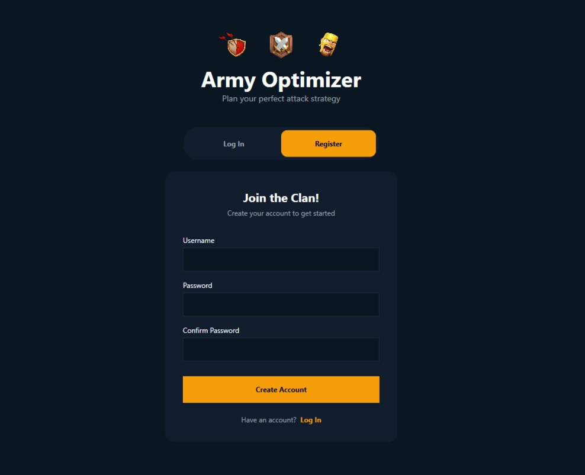

### 📌 Passos

1. Obre **Registre**
2. Escriu el teu nom d’usuari
3. Introdueix la contrasenya
4. Confirma la contrasenya
5. Prem **Create Account**

---

## 🔑 Iniciar sessió

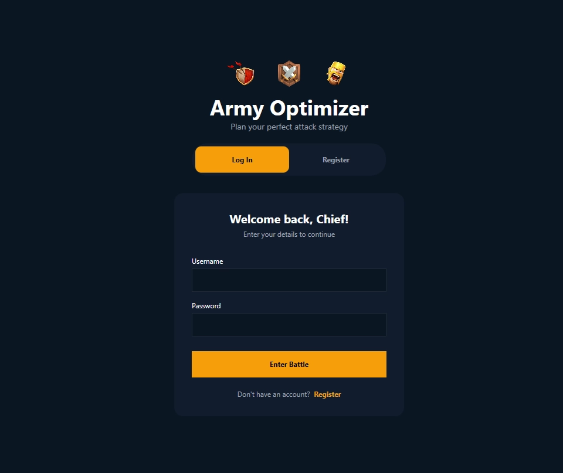

### 📌 Passos

1. Accedeix al Login
2. Escriu usuari i contrasenya
3. Prem **Iniciar sessió**

---

# 🏠 3. Pantalla principal

---

# 🏰 4. Selecció de Town Hall

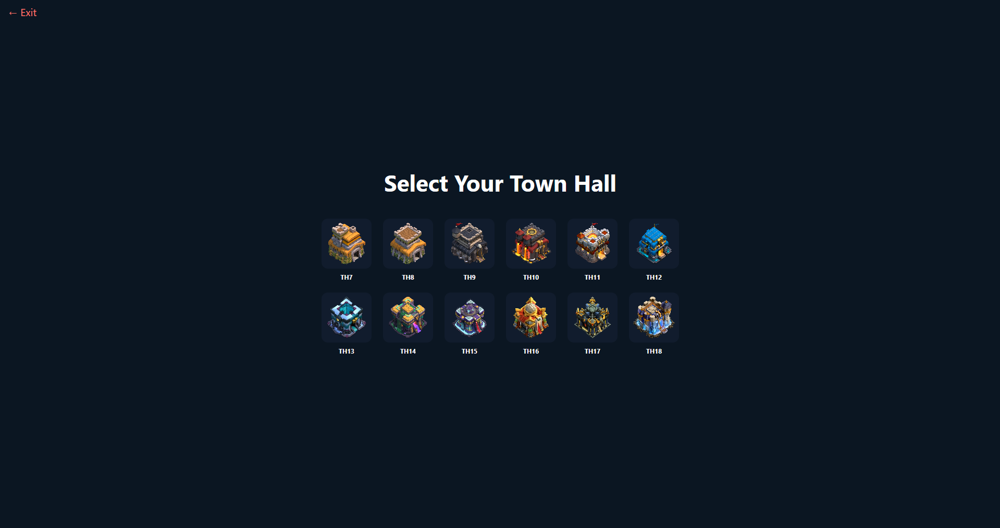

### 📌 Passos

1. Entrar a Town Hall
2. Seleccionar nivell
3. Confirmar

---

# ⚔️ 5. Selecció de tropes

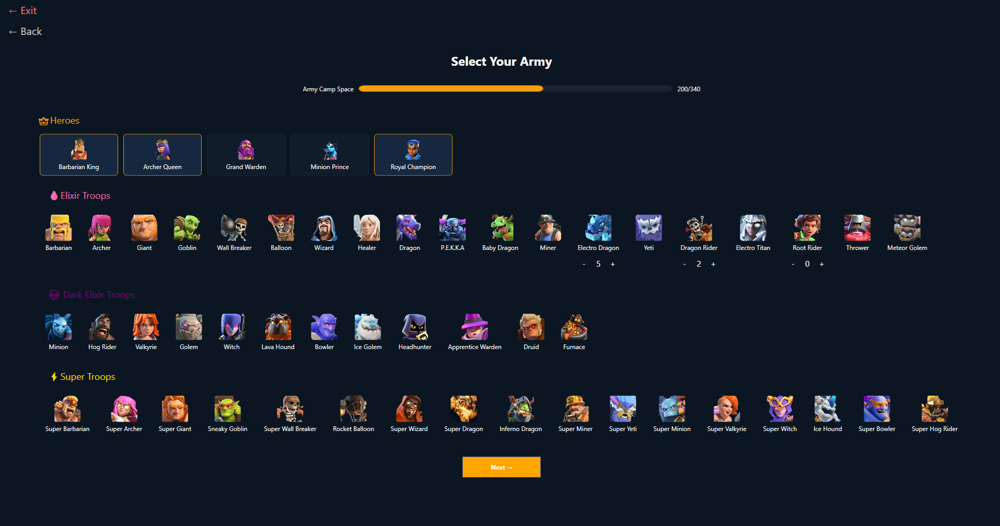

### 📌 Passos

1. Obrir Tropes
2. Afegir unitats
3. Ajustar quantitats
4. Revisar rols

---

# 🧪 6. Selecció d'encanteris

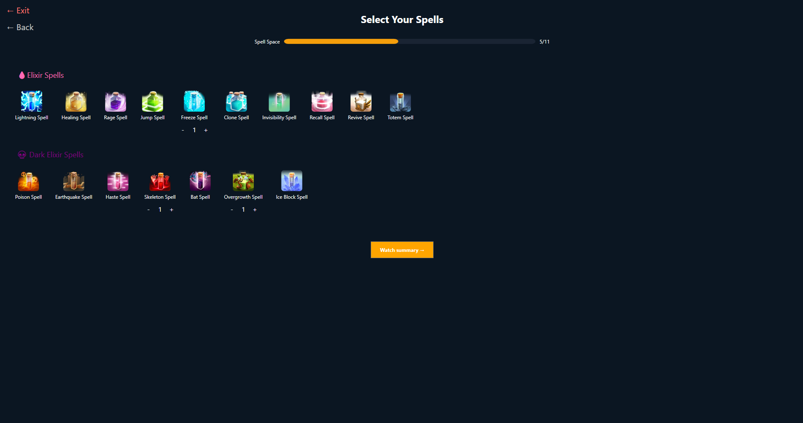

---

# 🏹 7. Màquines bèl·liques

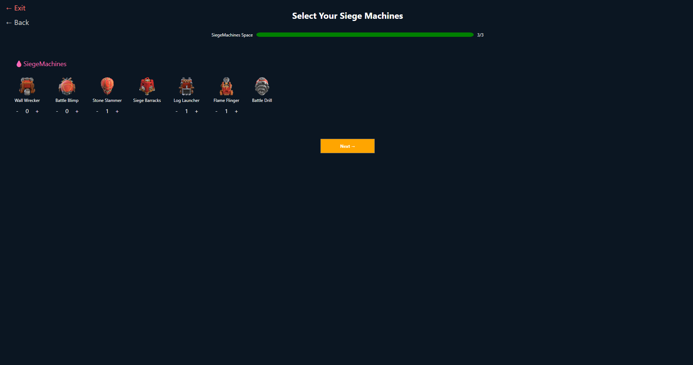

---

# 📊 8. Resum de l’exèrcit

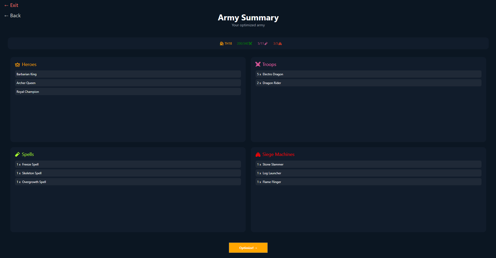

---

# 🧠 9. Optimització

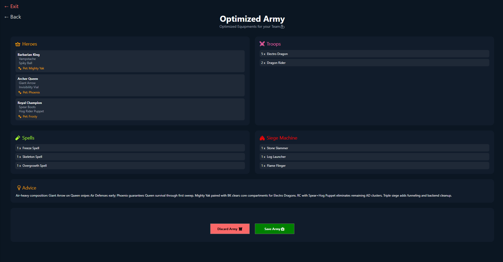

---

# 💾 10. Guardar exèrcit

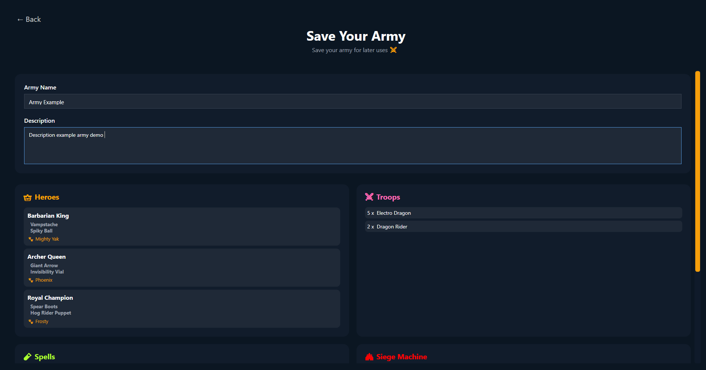

---

# 💳 11. Tokens i pagaments

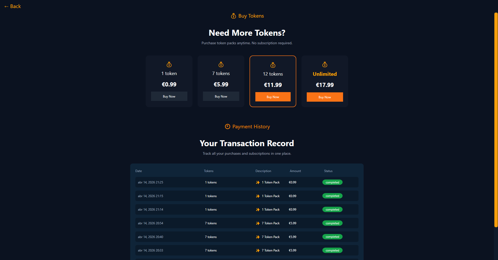

---

# 🏁 12. Conclusió

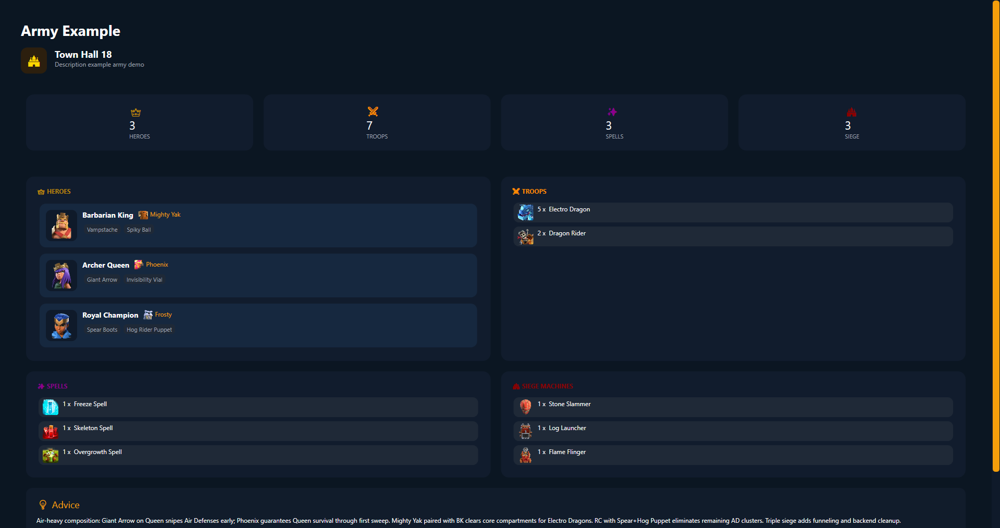

---

# 🚀 ArmyOptimizer

Planifica. Optimitza. Guanya.